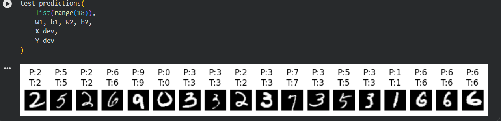

# Digit Recognizer (NN from Scratch)

## Overview
2-layer neural network built with NumPy to classify digits (0–9).

## Model
- Input: 784
- Hidden: 10 (ReLU)
- Output: 10 (Softmax)

## Dataset
- ~40k images
- 28x28 grayscale
- Labels: 0–9

## Results

